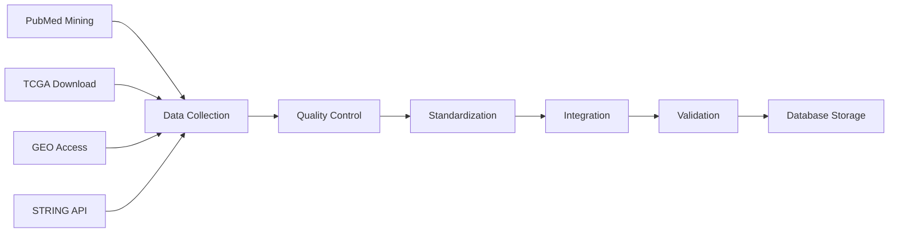

# Data Processing

Our data processing pipeline ensures high-quality, standardized, and validated data for colorectal cancer biomarker research.

> Detailed steps will be published in our other article, which is currently under review.

## Processing Pipeline

## Data Collection Methods

### Automated Collection

- **Literature Mining**: NLP algorithms extract biomarker information from PubMed
- **API Integration**: Direct data retrieval from TCGA, GEO, and STRING
- **Scheduled Harvesting**: Regular automated data collection from all sources
- **Change Detection**: Automated identification of new or updated data

### Manual Curation

- **Expert Review**: Domain experts validate extracted information
- **Clinical Relevance**: Assessment of clinical significance
- **Cross-Reference**: Verification against multiple sources
- **Quality Assurance**: Manual checks for data consistency

## Quality Control Procedures

- **Scientific Accuracy**: Domain experts verify scientific claims
- **Clinical Relevance**: Assessment of clinical significance
- **Methodological Review**: Evaluation of experimental methods
- **Statistical Validation**: Review of statistical analyses

## Data Standardization

### Nomenclature Standardization

- **Gene Names**: HGNC-approved gene symbols and aliases

- **Identifiers**: Consistent use of standard identifiers (PMID, DOI)
