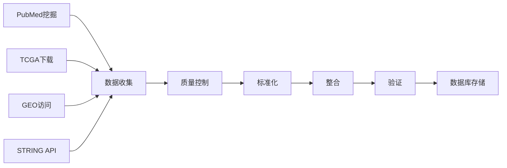

# 数据处理

我们的数据处理流程确保为结直肠癌生物标志物研究提供高质量、标准化和经过验证的数据。

> 详细步骤将在我们目前正在审阅的另一篇文章中发表。

## 处理流程

## 数据收集方法

### 自动收集

- **文献挖掘**：NLP算法从PubMed提取生物标志物信息
- **API集成**：从TCGA、GEO和STRING直接检索数据
- **定期收集**：定期自动收集所有来源的数据
- **变更检测**：自动识别新的或更新的数据

### 手动整理

- **专家审查**：领域专家验证提取的信息
- **临床相关性**：评估临床意义
- **交叉引用**：与多个来源进行验证
- **质量保证**：手动检查数据一致性

## 质量控制程序

- **科学准确性**：领域专家验证科学声明
- **临床相关性**：评估临床意义
- **方法学审查**：评估实验方法
- **统计验证**：审查统计分析

## 数据标准化

### 命名标准化

- **基因名称**：HGNC批准的基因符号和别名

- **标识符**：一致使用标准标识符（PMID、DOI）